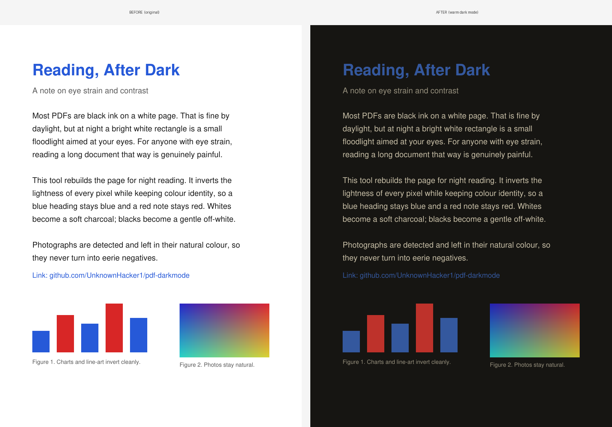
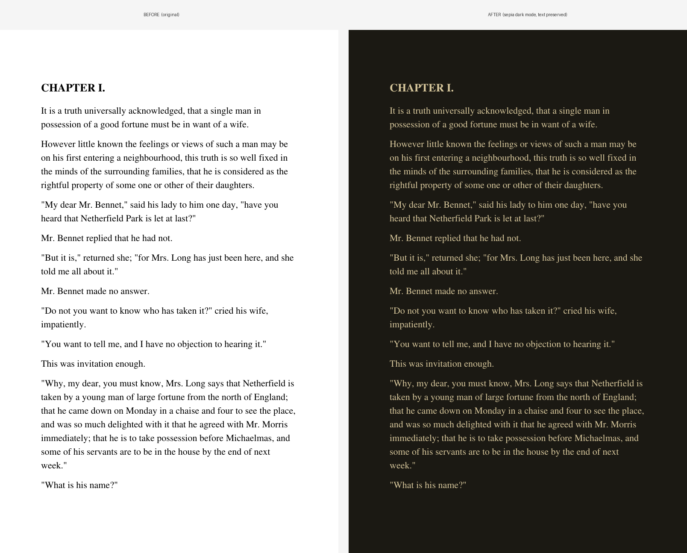

# 🌙 pdf-darkmode

Turn any PDF into a real dark-mode file you can actually read at night.

Reading a white PDF in a dark room is like someone pointing a flashlight at your face. If you get eye strain, or you just do a lot of reading in bed, it wears on you fast.

Here's the annoying part. Almost every "PDF dark mode" you can find is a browser extension. It only darkens the page while the file is sitting in that one tab. Close the tab, open the PDF on your phone, send it to a friend, and you're back to the white glare. A few reader apps will do it, but they want a subscription for the privilege.

pdf-darkmode does the obvious thing instead. It converts the whole file, right on your machine, and gives you back a new PDF. That file is dark everywhere you open it: your phone, your e-reader, offline, for good. No extension, no account, no monthly fee.



Same idea on a real book, using the *Pride and Prejudice* sample. This one was converted in text mode, so the words are still selectable and the whole file is about 75 KB:



## Doing it properly

Most tools "dark mode" a PDF by inverting the colors, and that breaks two things. Every hue flips, so blue headings go orange and red warnings go cyan. And photographs turn into creepy negatives. Pure white text on pure black is bad too: it smears and glows (that effect is called halation), which is its own kind of eye strain.

This tool was built to get past all of that.

**Colors stay recognizable.** It inverts the *lightness* of each pixel but keeps the hue, using an exact per-pixel reflection:

```
c' = 255 - max(r,g,b) - min(r,g,b) + c
```

White backgrounds go dark, black text goes light, and a blue link stays a readable blue.

**Easy on the eyes.** Blacks lift to a soft charcoal and whites drop to a gentle off-white, so you get contrast you can read for an hour without the glare.

**Photos still look like photos.** It spots real photographs and colorful figures and leaves them in their natural colors (dimmed a touch so they don't glare in the dark). Charts, diagrams and line art get inverted, since those look better dark anyway.

**Warm night themes.** Amber options knock the blue light down for late reading.

Bookmarks and the table of contents come along for the ride, so you can still jump around the document.

## Install

You need Python 3.9 or newer.

```bash
pip install pymupdf pillow numpy
```

Then grab the script. Clone the repo, or just download `pdf_darkmode.py` on its own:

```bash
git clone https://github.com/UnknownHacker1/pdf-darkmode.git
cd pdf-darkmode
```

## Usage

```bash
python pdf_darkmode.py paper.pdf
```

That drops a `paper_dark.pdf` next to the original. A few things you'll probably want:

```bash
# amber, low-blue-light theme, best late at night
python pdf_darkmode.py paper.pdf --theme warm

# keep the text selectable and the file tiny (born-digital PDFs)
python pdf_darkmode.py paper.pdf --mode text

# near-OLED pure dark, higher contrast, crisper text
python pdf_darkmode.py book.pdf --theme black --dpi 200

# a scanned or image-only document: force the whole thing to invert
python pdf_darkmode.py scan.pdf --images invert

# pick where the output goes
python pdf_darkmode.py paper.pdf -o ~/reading/paper_night.pdf
```

### Two ways to convert

| Mode | How it works | Output text | File size | Best for |
|------|--------------|-------------|-----------|----------|
| `image` *(default)* | Renders each page and inverts the pixels | Not selectable | Larger | Anything, scans included |
| `text` | Recolors the PDF's content in place, glyphs untouched | Selectable and searchable | Small, close to the original | Born-digital PDFs (LaTeX, Word/Docs exports, most ebooks) |

`--mode text` keeps the real text layer. If it runs into a page that's actually a scan (no text to recolor) or one that uses a color space it can't safely rewrite, that page quietly falls back to image mode, so you never get invisible text.

## Try it

The [`samples/`](samples/) folder has a few public-domain PDFs to convert:

```bash
python pdf_darkmode.py samples/01-classic-novel.pdf --mode text --theme sepia   # Pride and Prejudice
python pdf_darkmode.py samples/02-illustrated-report.pdf --theme warm           # charts + a photo
python pdf_darkmode.py samples/03-scanned-notes.pdf --images invert             # image-only scan
```

The `--mode text` line is the one that produces the *Pride and Prejudice* before/after up top.

## Options

| Flag | Default | What it does |
|------|---------|--------------|
| `--mode` | `image` | `image` renders every page (works on anything), `text` keeps selectable text (born-digital PDFs) |
| `--theme` | `charcoal` | Color theme (see below) |
| `--dpi` | `150` | Render resolution for image mode and scanned pages. Higher is crisper but bigger; try `200` for dense text |
| `--images` | `smart` | `smart` restores only photos, `keep` leaves all images natural, `invert` inverts everything |
| `--photo-dim` | `0.9` | Brightness of restored photos, from 0 to 1. Lower is dimmer and less glary |
| `-o`, `--output` | `<input>_dark.pdf` | Where to write the result |

### Themes

| Theme | Feel | Good for |
|-------|------|----------|
| `charcoal` | Neutral soft dark *(default)* | Almost everything |
| `black` | Near-OLED, high contrast | OLED screens, very dark rooms |
| `warm` | Amber, low blue light | Late-night reading |
| `sepia` | Candlelight | Long sessions, warm preference |
| `dim` | Low-contrast grey on grey | High light sensitivity |

## How it works

**Image mode** renders each page and works on the pixels:

1. Renders the page to a bitmap at the chosen DPI (so it works even when there's no text layer, scans included).
2. Applies the hue-preserving lightness inversion.
3. Remaps the tonal range into the theme's soft floor and ceiling, then adds any warm tint.
4. Finds photographic regions (midtone density plus [Hasler-Süsstrunk colorfulness](https://infoscience.epfl.ch/record/33994)) and restores them to natural color.
5. Reassembles the pages into a new PDF and carries the table of contents across.

**Text mode** never rasterizes a born-digital page. It reads each page's content stream and rewrites only the color operators (`g`, `rg`, `k` and their stroke variants) through the same lightness inversion, then paints a dark background behind everything. The glyphs, fonts and positions are left exactly as they were, so the text stays real, and embedded photos are left alone, so they keep their natural color. Any page without a text layer falls back to image mode.

## Limitations

Worth knowing before you run it on something important:

- **Image mode** re-renders the page, so the output text isn't selectable or searchable and the file is bigger. Use `--mode text` to avoid both on born-digital PDFs.
- **Text mode** works on standard device colors, which covers most LaTeX, Word and Docs exports, and ebooks. A page whose text is set in an exotic color space, or one that's really a scan, drops back to image mode on its own. Raster images inside a page are left as-is, so a bright line-art figure on a white background stays bright.
- The photo detector in image mode is a heuristic. On a scan with a grey or cream background it can mistake a text page for a photo, in which case `--images invert` forces the whole page dark.

## Roadmap

- [x] Text-preserving mode (recolor the content instead of rasterizing) for small, selectable output, via `--mode text`
- [ ] Extend text mode to non-device color spaces (ICC and separation blacks)
- [ ] JPEG page option for smaller image-mode files
- [ ] Batch mode for a whole folder of PDFs
- [ ] Per-page parallelism for big books

## Why this exists

I read a lot at night and I get eye strain, and none of the existing options actually fixed it. I wanted a dark copy of the file itself, not a filter that lives in a browser tab. So I wrote one. If it saves your eyes too, that's the whole point.

## Contributing

Issues and pull requests are welcome. If you hit a PDF that comes out wrong, open an issue with a short description or a sample page and I'll take a look.

## License

[MIT](LICENSE). Do whatever you like with it.
